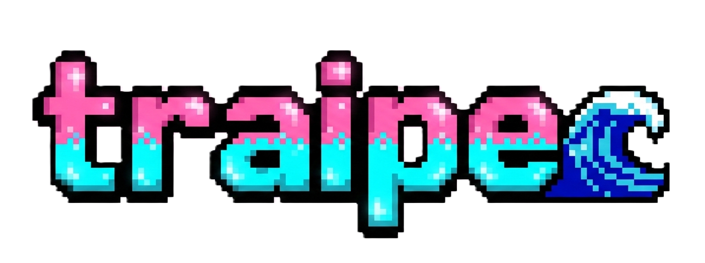

# 🌟 Hola, Mundo! 🌍

## Mari mari! 🙌🏽 | Hey there! 👋🏽 | Holaaa! 🙋🏽‍♀️

### ¡Éste es mi perfil! Mi nombre es Jimena Traipe, Desarrolladora Full Stack y relatora digital. 
Mente curiosa, en constante movimiento y con sed de conocimiento lista para los desafíos.
📍 Desde Chile 🇨🇱

---

## 💻 Lo que hago

Me enfoco en **programación y desarrollo web**, aplicando tecnologías emergentes como **Python** y ahora profundizando en **Front-end** cursando Desarrollo de Aplicaciones Front-End Trainee
(JavaScript y Vue.js).  
Me apasiona crear soluciones creativas, accesibles y seguras para usuarios y proyectos educativos.

---

## 🎓 Educación

- ✅ **2023**Certificación en **Soporte TI** – Coursera.  
- ✅ **2024 Desarrollo Full Stack Python** – Talento Digital Chile, Sence y Altaexperticia
- ✅ **2025**Curso de **Ciberseguridad en Sistemas Operativos Windows Server y Linux** – Talento Digital Chile, Sence e Inforcap  
- 📚 **Actualmente 2026**: **Front-end Trainee** – aprendiendo HTML, CSS, JavaScript y Vue.js 

---

## 🛠️ Habilidades

  
  
  
  
  
  
  
  
  

---

## 🌱 Experiencia

- Principiante con ansias de aprender y constancia en distintos intereses tecnológicos.
- Cursando a través de programas de Talento Digital para Chile, since 2023
- Experiencia en proyectos educativos y de formación digital.
- Candidata ideal para proyectos innovadores, seguros y comprometidos.  

---

## 📬 Contáctame

  
  

---

## ✨ Logo 

| 

---

## 👻 Fun Facts  

Me encanta:  
- tomar mate 🧉🫖  
- Hobbies: 🚴🏽‍♀️🛹🐈‍⬛🐕🧘🏽‍♀️📷🎞📽👗  
- Nivel 48 en Pokémon GO 🎮
- 

  <h3>¡Cuidado! Un Gengar salvaje ha aparecido 👻</h3>
  <h5>Encuentrame como: PireMawiza</h5>
 

---

##  ¡Mañümeyu tami witran!  
##  ¡Gracias por visitar mi perfil!  
##  Thank you for visiting my profile

